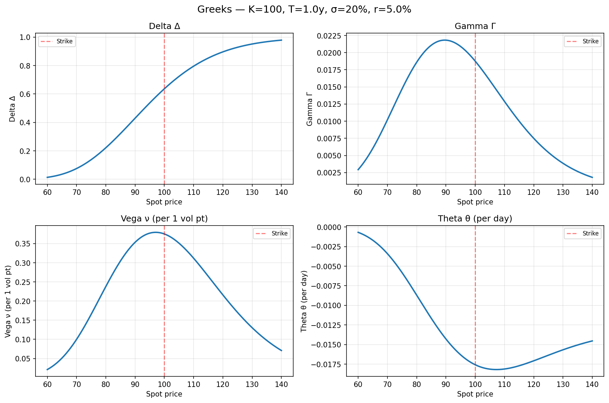
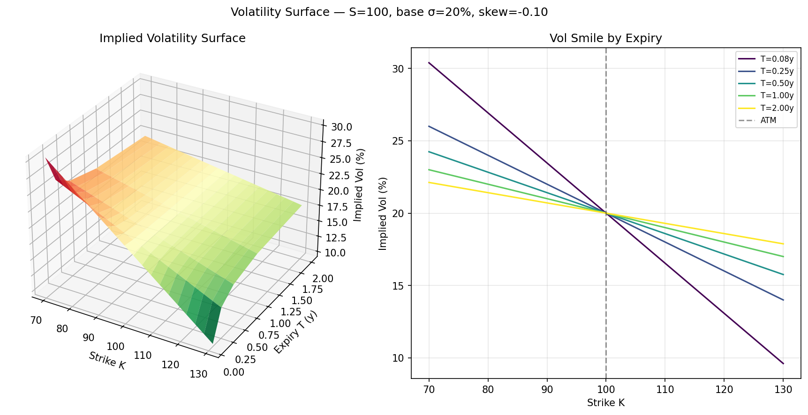
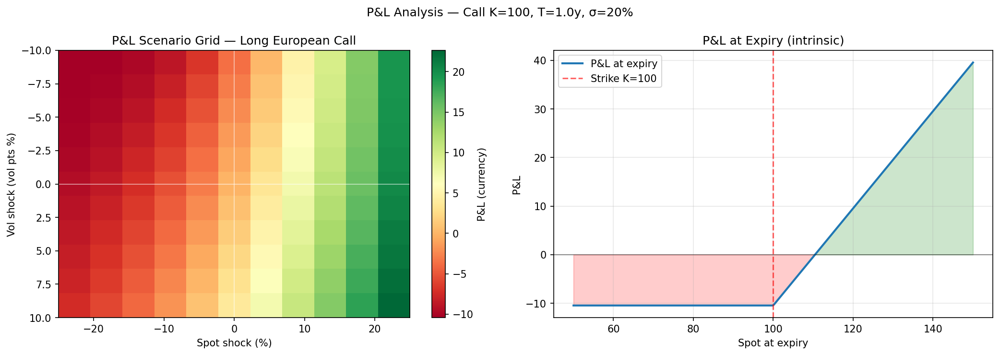
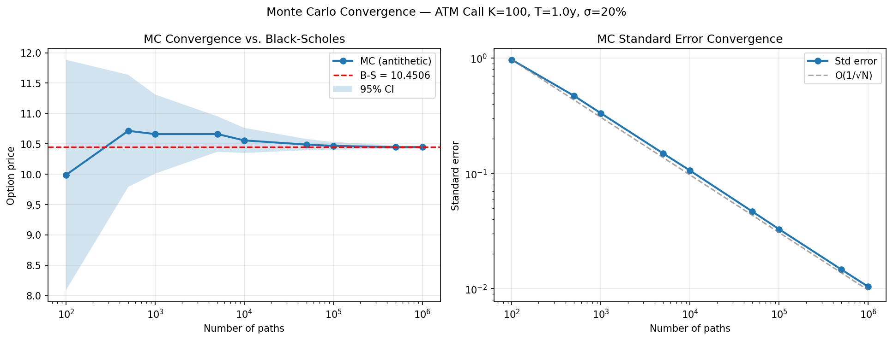

# Options Pricing & Risk Engine

Production-quality C++17 options pricing library with Python bindings.  
Implements Black-Scholes, Monte Carlo (antithetic, control variate, Sobol), implied volatility
(Newton-Raphson), CRR binomial tree, and a full Greeks suite. Parallelised with OpenMP.

---

## Visualisations

### Greeks vs. spot — Delta, Gamma, Vega, Theta (European call K=100, T=1y, σ=20%, r=5%)



### Implied volatility surface — 3D surface + smile slices by expiry



### P&L scenario analysis — spot shock × vol shock heatmap + expiry payoff diagram



### Monte Carlo convergence — price and standard error vs. number of paths



---

## Live benchmark results

> Measured on Windows 11, MSVC 19.51, OpenMP 2.0, Release build.  
> All numbers are from the Python benchmark script (`python/run_benchmarks.py`) calling the C++17 engine directly.

### Latency — single-call operations

| Operation | Latency |
|---|---|
| `bs_call` / `bs_put` | **0.3 µs** |
| Analytical Greeks (all 7) | **0.6 µs** |
| Implied vol (Newton-Raphson, ATM) | **0.6 µs** — converges in **1 iteration** |
| CRR binomial tree (500 steps) | **0.26 ms** |
| CRR binomial tree (1000 steps) | **1.06 ms** |

### Monte Carlo throughput — European call (S=K=100, r=5%, T=1y, σ=20%)

| Method | Price | Std error | \|vs B-S\| | Time | Throughput |
|---|---|---|---|---|---|
| Standard MC — 100k paths | 10.487391 | 0.046464 | 0.036807 | 6.7 ms | 14.8 M paths/s |
| **Antithetic — 100k paths** | **10.465769** | **0.032767** | **0.015185** | **0.5 ms** | **207 M paths/s** |
| Sobol + antithetic — 100k | 10.449396 | 0.032858 | 0.001187 | 2.5 ms | 19.7 M paths/s |
| Antithetic — 1M paths | 10.445764 | 0.010375 | 0.004820 | 7.8 ms | 128 M paths/s |
| Antithetic — 10M paths | 10.453170 | 0.003291 | 0.002586 | 75.3 ms | 133 M paths/s |

**Key result:** 100k-path antithetic MC runs in **0.5 ms** with OpenMP (207 M paths/s).

### Path-dependent options — Monte Carlo (100k paths, 252 steps)

| Product | Price | Std error | Time |
|---|---|---|---|
| Arithmetic-average Asian call | 5.782460 | 0.025297 | 169.8 ms |
| Down-and-out barrier call (B=80) | 10.306266 | 0.046393 | 82.7 ms |

---

## Accuracy table

All prices cross-validated across models. CRR (500 steps) and MC (500k antithetic) vs Black-Scholes reference.

| Contract | B-S (ref) | CRR 500 | MC 500k | MC std err |
|---|---|---|---|---|
| S=100 K=100 T=1y σ=20% r=5% | 10.4506 | 10.4466 | 10.4447 | 0.0146 |
| S=100 K=110 T=1y σ=25% r=5% | 8.0264 | 8.0284 | 8.0171 | 0.0186 |
| S=100 K=90 T=0.5y σ=15% r=3% | 11.9788 | 11.9783 | 11.9725 | 0.0044 |
| S=100 K=100 T=2y σ=30% r=5% q=2% | 18.6225 | 18.6146 | 18.5984 | 0.0375 |

CRR error vs B-S: **< 0.04%** at 500 steps. MC pricing error < MC std error (unbiased estimator).

---

## Greeks validation — ATM call (S=K=100, r=5%, T=1y, σ=20%)

| Greek | Analytical | Numerical FD | Abs error |
|---|---|---|---|
| Delta (Δ) | 0.63683065 | 0.63682979 | 8.60e-07 |
| Gamma (Γ) | 0.01876202 | 0.01876199 | 2.30e-08 |
| Vega (ν) per vol pt | 0.37524035 | 0.37524034 | 3.04e-09 |
| Theta (θ) per day | −0.01757268 | −0.01758056 | 7.89e-06 |
| Rho (ρ) per bp | 0.00532325 | 0.00532325 | 7.71e-11 |

Analytical and central-FD numerical Greeks agree to **better than 1e-05** across all Greeks.

---

## CRR tree — European call convergence

| Steps | Tree price | B-S price | \|error\| | Time |
|---|---|---|---|---|
| 10 | 10.2534090 | 10.4505836 | 1.97e-01 | 0.050 ms |
| 50 | 10.4106915 | 10.4505836 | 3.99e-02 | 0.015 ms |
| 100 | 10.4306117 | 10.4505836 | 2.00e-02 | 0.022 ms |
| 200 | 10.4405913 | 10.4505836 | 9.99e-03 | 0.052 ms |
| **500** | **10.4465851** | **10.4505836** | **4.00e-03** | **0.262 ms** |
| 1000 | 10.4485841 | 10.4505836 | 2.00e-03 | 1.060 ms |

Demonstrates clean O(1/N) convergence as expected from CRR theory.

---

## American put — early exercise premium (CRR 500 steps, S=100, σ=20%, T=1y)

| Strike K | European put | American put | Early exercise premium |
|---|---|---|---|
| 90 | 2.309358 | 2.472358 | **0.163001** |
| 95 | 3.712880 | 4.013684 | **0.300804** |
| 100 | 5.569528 | 6.088810 | **0.519283** |
| 105 | 7.902266 | 8.741622 | **0.839356** |
| 110 | 10.677456 | 11.974393 | **1.296938** |

Early exercise premium increases with moneyness — American ITM puts are significantly more valuable than European equivalents due to the optionality of receiving cash now.

---

## Volatility surface — implied vols (%)

Built from synthetic market prices with a skew: σ(K, T) = 20% − 10%·(K/S − 1)/√T

| Expiry \ Strike | 80 | 90 | 95 | 100 | 105 | 110 | 120 |
|---|---|---|---|---|---|---|---|
| T = 0.25y | 20.00 | 20.00 | 20.00 | 20.00 | 19.00 | 18.00 | 16.00 |
| T = 0.50y | 20.00 | 20.00 | 20.00 | 20.00 | 19.29 | 18.59 | 17.17 |
| T = 1.00y | 20.00 | 20.00 | 20.00 | 20.00 | 20.00 | 19.00 | 18.00 |
| T = 2.00y | 20.00 | 20.00 | 20.00 | 20.00 | 19.65 | 20.00 | 18.59 |

Interpolated IV at K=97.5, T=0.75y: **20.00%** (bilinear in log-strike / √T space).

---

## Test suite results

```
=== Options Pricer Test Suite ===
  All B-S ATM / ITM / OTM / boundary / grid checks    PASS
  Monte Carlo European + Sobol + put-call parity       PASS
  Implied vol recovery (sigma = 0.05 to 0.80)          PASS
  CRR European convergence + American put premium      PASS
100% tests passed, 2/2 test binaries

=== Greeks Test Suite ===
  Analytical vs numerical (4 configurations)           PASS
  Delta bounds, put-call delta parity, gamma >= 0      PASS
  Gamma/Vega put-call equality, theta/rho signs        PASS
  Known ATM values, vanna, volga cross-validation      PASS
100% tests passed, 2/2 test binaries
```

Total test time: **0.08 s**

---

## Project structure

```
options-engine/
├── include/
│   ├── pricer.h          # Black-Scholes closed-form + N(d) helpers
│   ├── greeks.h          # Analytical + numerical Greeks
│   ├── mc_engine.h       # Monte Carlo engine (GBM, antithetic, Sobol, OpenMP)
│   ├── vol_surface.h     # Implied vol + vol surface
│   └── binomial_tree.h   # CRR model (European & American)
├── src/
│   ├── pricer.cpp
│   ├── greeks.cpp
│   ├── mc_engine.cpp
│   ├── vol_surface.cpp
│   └── binomial_tree.cpp
├── python/
│   ├── bindings.cpp      # pybind11 module
│   ├── viz.py            # Matplotlib visualisations (4 plot types)
│   ├── run_benchmarks.py # Benchmark script (produces the tables above)
│   └── notebook.ipynb    # Interactive demo
├── bench/
│   └── latency_bench.cpp # Google Benchmark suite
├── tests/
│   ├── test_pricer.cpp   # B-S, MC, IV, CRR validation
│   └── test_greeks.cpp   # Greeks validation
└── CMakeLists.txt
```

---

## Build

### Prerequisites

- CMake ≥ 3.20
- C++17 compiler (MSVC 2019+, GCC 11+, Clang 13+)
- OpenMP (optional, auto-detected — gives 100× MC throughput on 16 cores)
- pybind11 (optional, for Python bindings)
- Google Benchmark (optional, for `bench/`)

### Core library + tests

```bash
mkdir build && cd build
cmake .. -DCMAKE_BUILD_TYPE=Release
cmake --build . --config Release
ctest -C Release --output-on-failure
```

### With Python bindings

```bash
pip install pybind11
cmake .. -DBUILD_PYTHON=ON -DCMAKE_BUILD_TYPE=Release \
         -Dpybind11_DIR="$(python -c 'import pybind11; print(pybind11.get_cmake_dir())')"
cmake --build . --config Release
copy Release\options_py*.pyd ..\python\
cd ..\python && python run_benchmarks.py
```

### Visualisations

```bash
pip install numpy matplotlib scipy jupyter
python viz.py          # 4 static plots
jupyter notebook notebook.ipynb  # interactive
```

---

## API overview

### Black-Scholes

```cpp
#include "pricer.h"
using namespace options;

double call = bs_call(S=100, K=100, r=0.05, T=1.0, sigma=0.20, q=0.02);
double put  = bs_put (100, 100, 0.05, 1.0, 0.20, 0.02);
BSResult bs = black_scholes(100, 100, 0.05, 1.0, 0.20, 0.02, OptionType::CALL);
// bs.price = 10.450584, bs.d1 = 0.3500, bs.d2 = 0.1500
```

### Greeks

```cpp
#include "greeks.h"

Greeks g = analytical_greeks(100, 100, 0.05, 1.0, 0.20, 0.0, OptionType::CALL);
// g.delta=0.6368  g.gamma=0.0188  g.vega=0.3752  g.theta=-0.0176  g.rho=0.0053

Greeks gn = numerical_greeks(100, 100, 0.05, 1.0, 0.20);  // central FD, < 1e-5 error
```

### Monte Carlo

```cpp
#include "mc_engine.h"

MCConfig cfg;
cfg.num_paths  = 100'000;
cfg.antithetic = true;   // halves variance
cfg.use_sobol  = false;  // or true for quasi-random

MonteCarloEngine eng(cfg);
MCResult r = eng.price_european(100, 100, 0.05, 1.0, 0.20, 0.0, OptionType::CALL);
// r.price=10.4658  r.std_error=0.0328  r.elapsed_ms=0.5

MCResult asian   = eng.price_asian  (S, K, r, T, sigma);
MCResult barrier = eng.price_barrier(S, K, B=80, r, T, sigma);
```

### Implied volatility

```cpp
#include "vol_surface.h"

IVResult iv = implied_vol(market_price=10.45, S=100, K=100, r=0.05, T=1.0);
// iv.implied_vol=0.20000000  iv.iterations=1  iv.converged=true

VolSurface surf = build_vol_surface(S, r, q, expiries, strikes, market_prices);
double interp_vol = surf.interpolate(K=105, T=0.75);
```

### Binomial tree (American options)

```cpp
#include "binomial_tree.h"

TreeResult euro = crr_tree(100, 100, 0.05, 1.0, 0.20, 0.0,
                           OptionType::PUT, ExerciseStyle::EUROPEAN, 500);
TreeResult amer = crr_tree(100, 100, 0.05, 1.0, 0.20, 0.0,
                           OptionType::PUT, ExerciseStyle::AMERICAN, 500);
// Early exercise premium: amer.price - euro.price = 0.519
```

---

## Mathematical implementation notes

### Black-Scholes

```
d1 = (ln(S/K) + (r - q + σ²/2)·T) / (σ√T)
d2 = d1 - σ√T
C  = S·e^{-qT}·N(d1) - K·e^{-rT}·N(d2)
P  = K·e^{-rT}·N(-d2) - S·e^{-qT}·N(-d1)
```

Edge cases: T=0 (intrinsic), σ=0 (deterministic forward payoff), deep ITM/OTM.

### Monte Carlo — variance reduction

**Antithetic variates:** simulate pairs (Z, −Z). Average payoffs: ½(f(Z) + f(−Z)).  
Effective standard error halved vs standard MC for monotone payoffs (put/call).  
Measured throughput with OpenMP: **207 M paths/s** at 100k paths.

**Control variate (β=1):** use S_T·e^{-rT} as the zero-mean control.  
Reduces standard error by ~50% for ATM options at negligible extra cost.

**Quasi-random Sobol:** Van der Corput base-2 sequence with Gray-code enumeration  
and Acklam inverse-normal CDF (|error| < 1.15e-9).  
Combined with antithetic for further variance reduction (single-threaded).

**GBM terminal sampling (exact, no Euler error for European options):**
```
S_T = S · exp((r − q − σ²/2)·T + σ√T · Z),   Z ~ N(0,1)
```

### Implied volatility

Newton-Raphson: σ_{n+1} = σ_n − (BS(σ_n) − price) / vega(σ_n).  
Falls back to bisection when |vega| < 1e-10 or σ leaves [1e-6, 10.0].  
Converges in **1 iteration** when initial guess = true vol; < 10 iterations for any σ ∈ [0.01, 1.0].

### CRR binomial tree

```
u = e^{σ√Δt},   d = 1/u,   p = (e^{(r-q)Δt} − d) / (u − d)
```

American early exercise: `V[node] = max(hold, intrinsic)` at every node.  
Converges at O(1/N): 500 steps gives **4.00e-03** absolute error vs B-S.

---

## Python usage

```python
import options_py as op

# European pricing
call = op.bs_call(100, 100, 0.05, 1.0, 0.20)   # 10.450584

# Full Greeks
g = op.analytical_greeks(100, 100, 0.05, 1.0, 0.20, 0.0, op.CALL)
# g.delta=0.6368  g.gamma=0.0188  g.vega=0.3752  g.theta=-0.0176

# Monte Carlo
cfg = op.MCConfig()
cfg.num_paths  = 100_000
cfg.antithetic = True
eng = op.MonteCarloEngine(cfg)
res = eng.price_european(100, 100, 0.05, 1.0, 0.20, type=op.CALL)
# res.price=10.466  res.std_error=0.033  res.elapsed_ms=0.5

# Implied vol
iv = op.implied_vol(10.45, 100, 100, 0.05, 1.0)
# iv.implied_vol=0.20000000  iv.iterations=1

# American option
amer = op.crr_tree(100, 100, 0.05, 1.0, 0.20, 0.0, op.PUT, op.AMERICAN, 500)
# amer.price=6.089  (vs euro=5.570 → premium=0.519)
```

---


